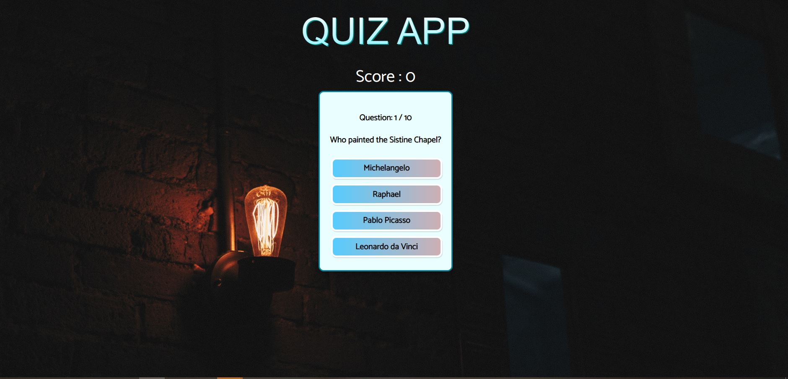
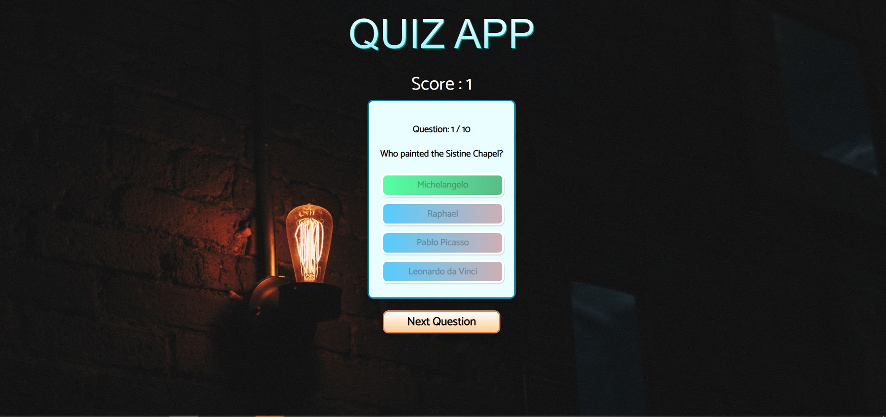
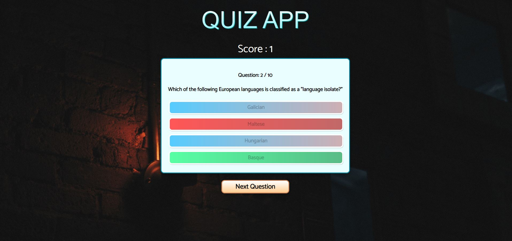

# Demo Quiz App Using React and Typescript
This is a demo application that I have built inorder to understand functionalities of react and typescipt.

### Live Preview
  

## Things that I have learned,
- Creating react project with typescript support.
- How to use ENums.
- Passing props in the typescript way.
- Fetching from an end-point and converting it to a json right away.
- Benefits of using typescript, rather than using javascript.
- Spread operator in ES6.
- Converting in to boolean. (using !! method)
- How to create global styles.
- Optional chaining in typescript
  
## Screenshots
  
  
  
  
### Online Tutorial
[React/Typescript Tutorial - Build a Quiz App by Thomas Weibenfalk](https://youtu.be/F2JCjVSZlG0 "React/Typescript Tutorial - Build a Quiz App by Thomas Weibenfalk")

    

